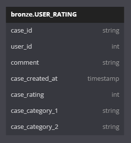
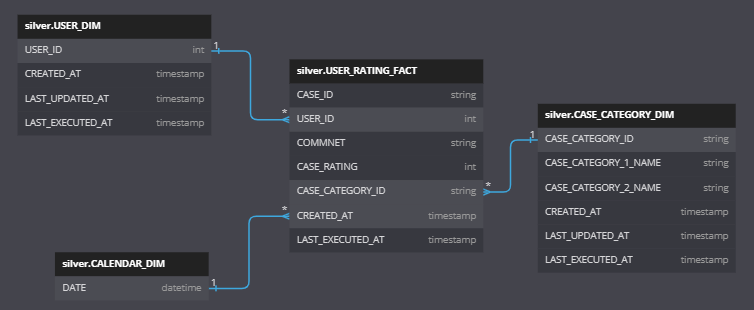
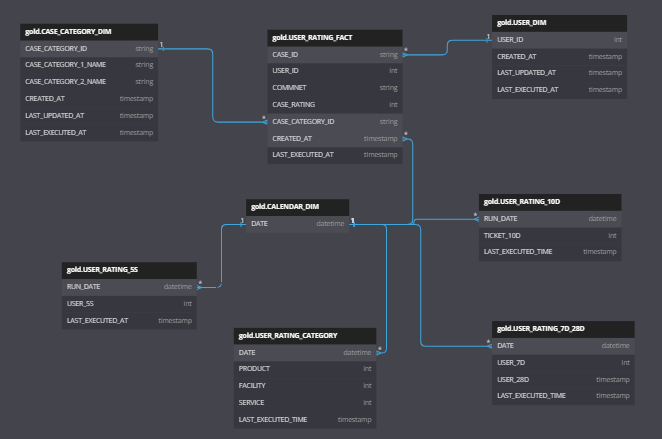
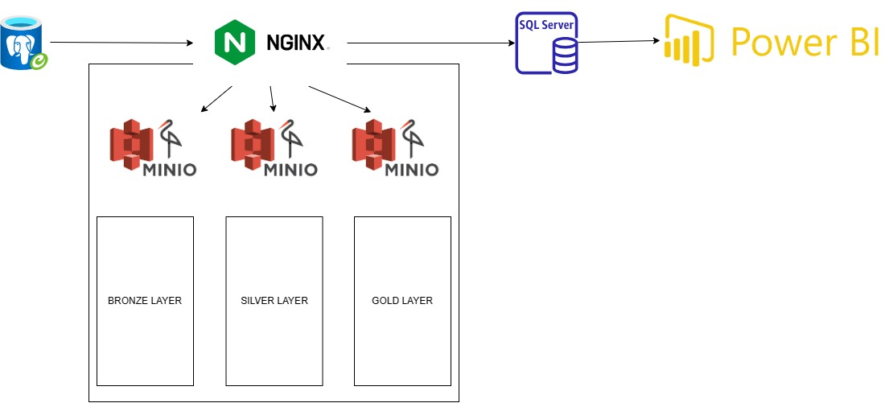
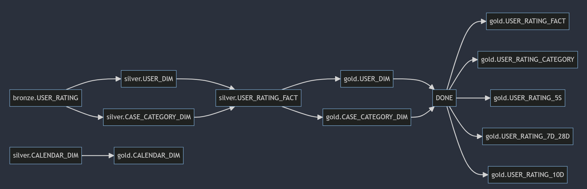
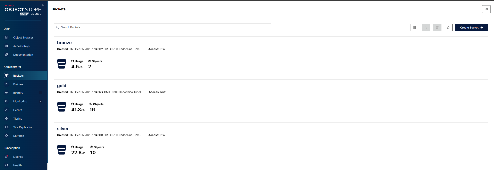
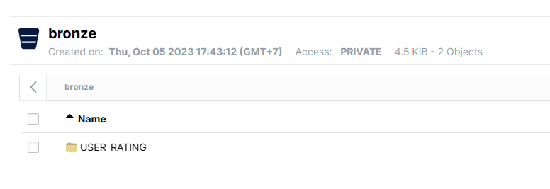
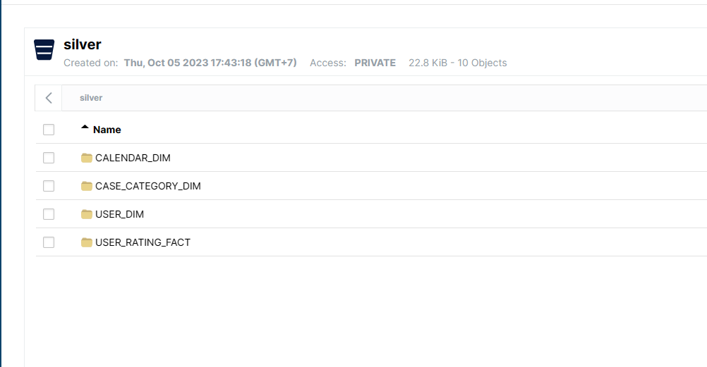
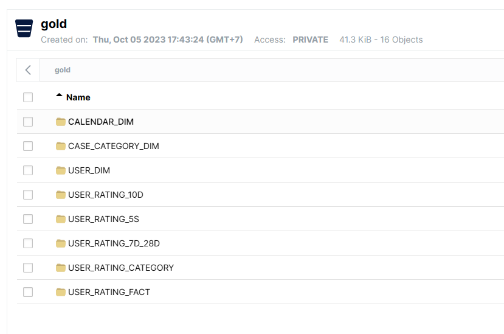
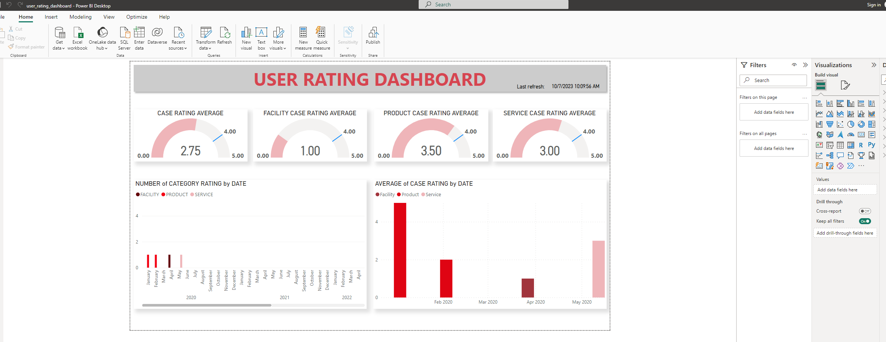

# USER RATING

Project này là POC cho quá trình ETL và Reporting từ datasource

## ANSWER QUESTION
1. Số ticket 10 ngày gần nhất:
    - `./src_code/transfer_USER_RATING_10D.ipynb`
2. Đếm số khách hàng có phản hồi 5 sao trong 7 ngày vừa qua
    - `./src_code/gold_USER_RATING_5S.ipynb`
3. Pivot table theo Category
    - `./src_code/gold_USER_RATING_CATEGORY.ipynb`
4. Dashboard
    - `./user_rating_dashboard.pbix`
    - `./user_rating_dashboard.pdf`
5. Optimize dataware house:
    Để tối ưu chi phí cũng như tăng tốc độ xử lý data warehouse:
    - Sử dụng công nghệ mới như lakehouse để giảm thiểu chi phí phụ thuộc vào các database truyền thống. Lake house bao gồm Spark - Computing engine và Delta Lake - Storage giúp cho tốc độ xử lý cao, chi phí lưu trữ thấp hơn so với database, đảm bảo tính ACID khi xử lý data.
    - Partitioning data đối với data có low cardinality, và Z-Ordering với data có high cardinality.

6. Tổng số user feedback trong 7 và 28 ngày gần nhất: dùng window funciton
    - `src_code/gold_USER_RATING_7D_28D.ipynb`

## Environment

`DOCKER`
- `Spark`
- `Minio`
- `Nginx`
- `SQL Server`
- `Jupyter`
- `Postgres`

`POWER BI`


## Deployment
Start docker environment
```bash
docker-compose up
```
Dump data to postgres
```bash
[link](./postgres.sql)
```

Login to jupyter environment on `dev` container
```bash
http://127.0.0.1:8888/
```

## ERD
### Bronze


### Silver


### Gold


## ARCHITECTURE DESIGN



## ETL STRATEGY
### MODELLING
Project này được modelling theo medalion architecture
- 

- Bronze Layer: Raw integration từ datasource
- Silver Layer: modeling theo Start schema, cleaning, augmentation
- Gold Layer: Aggregation, Filter và theo bussisness

Cre: https://www.databricks.com/glossary/medallion-architecture
### ORCHESTRATION
Do thời gian có hạn nên project này chưa bao gồm orchestrator implementation. Nếu có đủ thời gian, `Airflow` sẽ được chọn làm orchestrator.

- Daily: Incremental
- Monthly: Full load

Để giảm thiểu độ trễ giữa data source, có thể kết hợp lambda architect với việc sử dụng `Kafka` cho Speed Layer. Batch Layer sẽ được run vào EOD




## RESULT
    
    
    
    
    